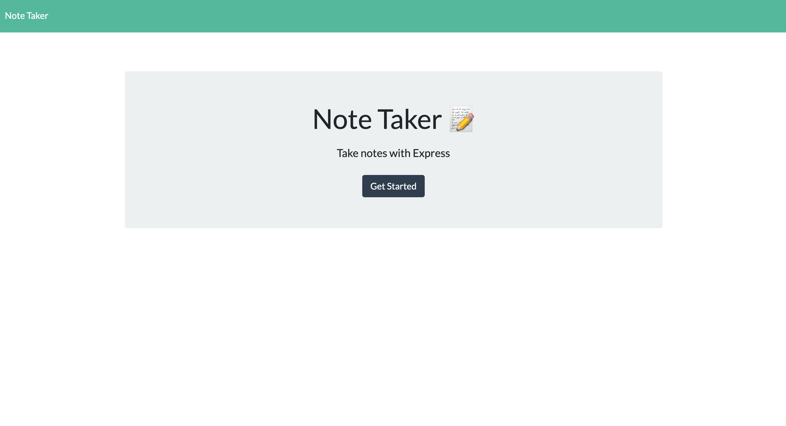
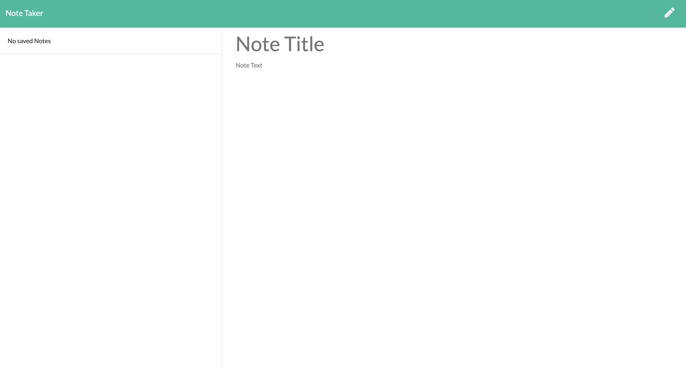
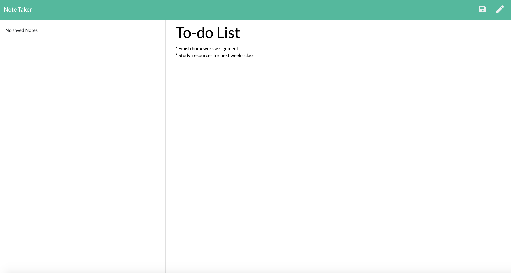
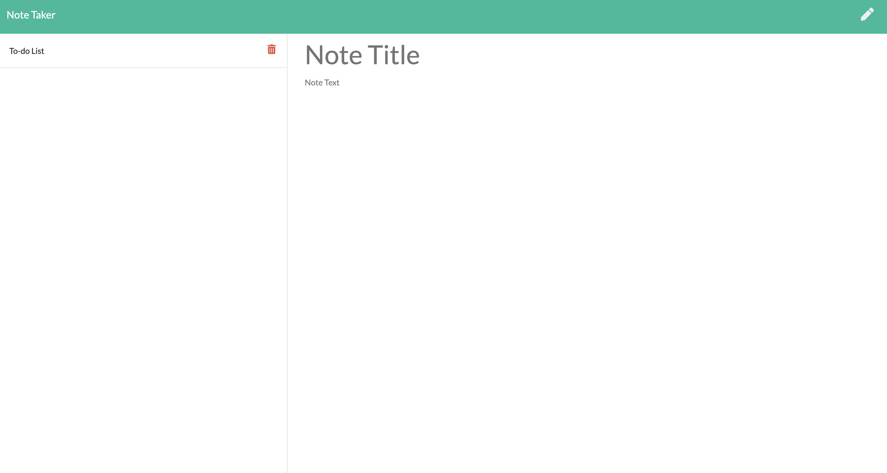
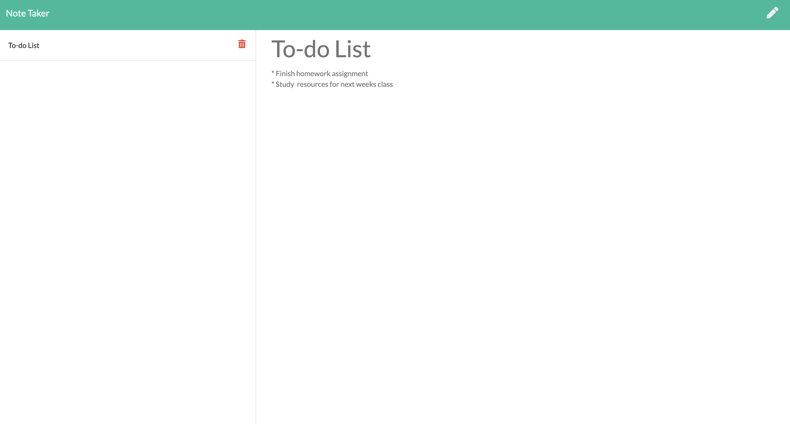

# Taking Notes with Express

## Table of Contents

* [Description](#description)
* [Usage](#usage)
* [Contributing](#contributing)
* [Tests](#tests)
* [Questions](#questions)
* [License](#license)

## Description
This application allows the user to write and save notes to better organize their thoughts and keep track of tasks needing to be completed.

## Usage
The user will click the 'Get Started' button on the landing page, which will take them to the note taking page. This is where the user can either create a new note and click the 'save' button or view an exsisting note they have already created. If you would like to view a note alredy created, simply click on the saved note and it will display back on the center of the page. There is also an option to delete any saved notes, if you select the trashcan icon on the right side of the saved note. You may start a new note by clicking the pencil icon on the top right corner of the page.

## Contributing
If you'd like to contribute to this project, start by forking the repository to your personal GitHub account. From there, make your changes and then open a Pull Request in this repository against the branch in your fork.

## Tests
There are no tests at this time.

## Questions
GitHub: [CdFox2019](https://github.com/CFox2019)

Email me at [courtney.fox@me.com](courtney.fox@me.com) with additional questions.

## License
This project is covered under the MIT license.
